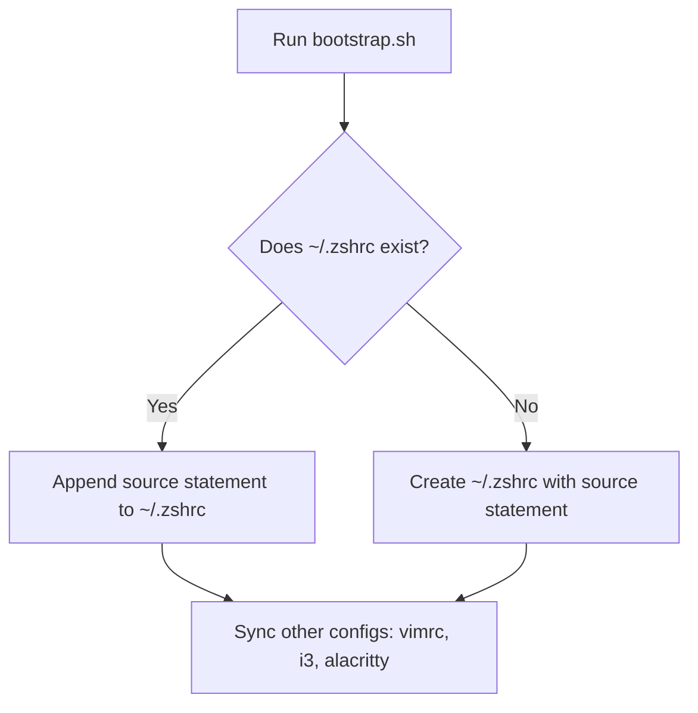

# Implementation Plan: Zshrc Sourcing & Select Device Integration

## 1. Zshrc Modification Flow

## 2. Directory Structure Changes

| Target | Action | Destination / Path |
|---|---|---|
| `zsh/plugins/adb-device-select/` | Create directory | `zsh/plugins/adb-device-select/` |
| `adb-device-select.plugin.zsh` | Copy code | `zsh/plugins/adb-device-select/adb-device-select.plugin.zsh` |
| `README.md` (from plugin) | Copy file | `zsh/plugins/adb-device-select/README.md` |

## 3. Configuration & Sourcing Mechanics

* **Bootstrap Update (`scripts/bootstrap.sh`)**:
  * Replace symlinking of `.zshrc` with a function that appends the sourcing block to `~/.zshrc`.
  * Ensure path to `$REPO_ROOT/zsh/.zshrc` is absolute and correctly expanded.
* **Relative Path Resolution (`zsh/.zshrc`)**:
  * Define `ZSH_KIT_DIR="${${(%):-%x}:a:h}"` to resolve the kit's directory dynamically.
  * Source `adb-device-select` using `ZSH_KIT_DIR`.
  * Source `aliases.zsh` (e.g. from `ZSH_KIT_DIR` or fallback to `~/.zsh_aliases`).

## 4. Next Steps
* [ ] Copy the plugin files from `/home/gb/code/adb-device-select` to `zsh/plugins/adb-device-select/`.
* [ ] Modify `scripts/bootstrap.sh`.
* [ ] Modify `zsh/.zshrc`.
* [ ] Test zsh startup and `select_device` execution.
* [ ] Commit changes and raise PR when requested.
